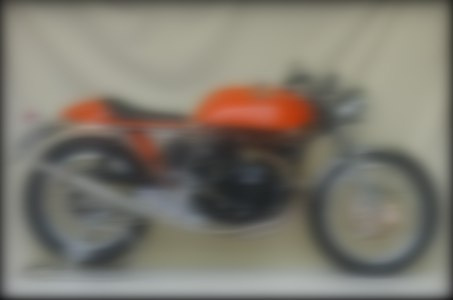
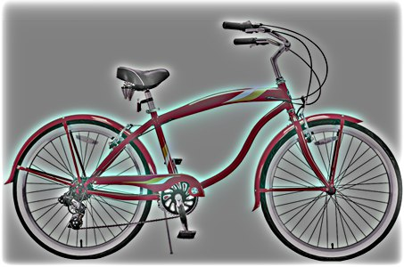
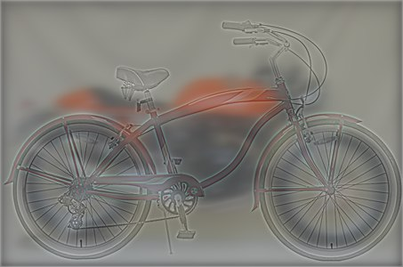

# convolution
the project was created to make convolution filter for the images:
we have 2 images and we would like to create low-pass filter and high-pass filter and sum them together. These filters can be used futher in computer vision in convolutional neural networks. 

Examples of pictures: 

